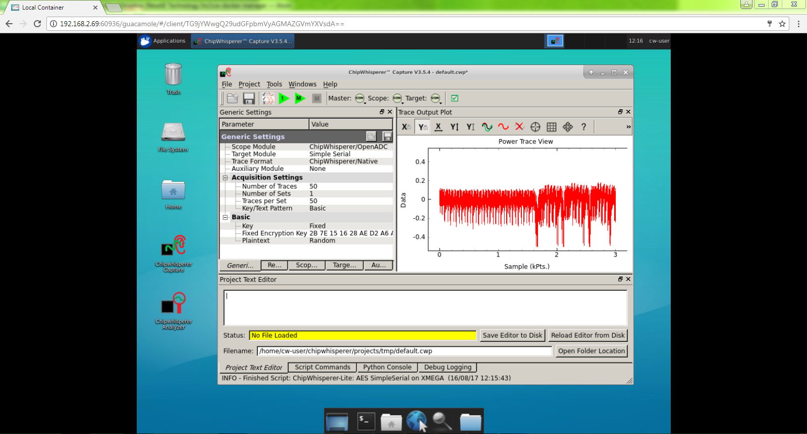

# Side Channel *Live!*

Welcome to Side Channel *Live!*. This "tutorial" is running at CHES 2017 in Taipei, Taiwan on September 25th. The objective is to provide some hands-on time for anyone interested in side-channel power analysis (or maybe a little fault injection) to work with some targets & tools.

A quick introduction will also be included, for anyone who is new to the field.

Note the final documentation will be updated closer to the actual event, with traces released shortly before it.

### Agenda ###

**13:00 - 13:30** Introduction, Event Setup, Data Format, Challenges.

**13:30 - 14:30** Tutorial on power analysis (for those new to field).

**14:30 - 15:00** Break

**15:00 - 16:00** Work on challenges, short presentations.

**16:00 - 16:30** Wrap-Up

# Hands-on Hardware #

Hardware for checkout (please work in teams if possible):

* AVR/XMEGA Targets.
* ARM Targets (STM32Fx).
* Artix FPGA Target.
* Several ChipWhisperer capture boards.
* Peak CAN interface.
* PicoScope USB scope.

## Example Projects ##

* Test CAN communication, implement some crypto.
* Use PicoScope to measure power analysis.
* Run AES on Artix board, break with ChipWhisperer (or PicoScope).
* Run demos on XMEGA, AVR, STM32Fx, etc.

# Remote Server #

A local server exists for your ChipWhisperering needs. This server is actually a laptop so we'll see how well it handles the load. There is twelve ChipWhisperer-Lite devices attached to it which you can use.

This provides ChipWhisperer software from the web browser:

To access this:

1. Find the "ChipWhisperer" wifi access point.
2. Navigate to http://chipwhisperer (or try going anywhere, it should redirect there)
3. Click on the link to the Virtual ChipWhisperer devices.

## Guacamole Usage ##

**Ctrl+Shift+Alt** will open the menu to change settings and perform a file transfer from the user's computer to the container. An in-depth introduction to using the browser client can be found [here](https://guacamole.incubator.apache.org/doc/gug/using-guacamole.html).

# Open Challenges #

Files are hosted [as a github release](https://github.com/newaetech/SideChannelLive/releases/tag/ches2017) .

### File Format Conversion ###

The files provided are in the ChipWhisperer format, which is really just a NumPy format.

If you want to quickly convert them to something else, see the example [on the wiki](https://wiki.newae.com/File_Formats). It may be possible to perform nicer conversions using the ChipWhisperer API, but the "hacky" solution on that wiki page only relies on standard Python libraries so may be faster.

### Calibration Waveforms ###

Several calibration waveforms are available, which may help you confirm your CPA attack is working as expected.

* sclive_cal1_swaes_onefile: SW AES, recorded into a single numpy file. Should be breakable in ~20-30 traces.
* sclive_ca2_swaes_multifile_data: SW AES, recorded into multiple numpy files. Should be breakable in ~20-30 traces.

### Hardware Crypto ###

The following traces have been collected from various devices.

#### Device #1 ####
* hwaes_countermeasureswrong_20k: HW Crypto (AES), no countermeasures.

* hwaes_countermeasuresright_20k: HW Crypto (AES), basic countermeasures.
   
#### Device #2 ####
* hwaes_dev2_100ktraces: HW Crypto (AES), unknown details (different chip from before).
    
# Contributing Changes #

All files/write-ups will be stored in the "CHES2017" directory. Please feel free to submit pull requests to this repository so we can keep any interesting results public.